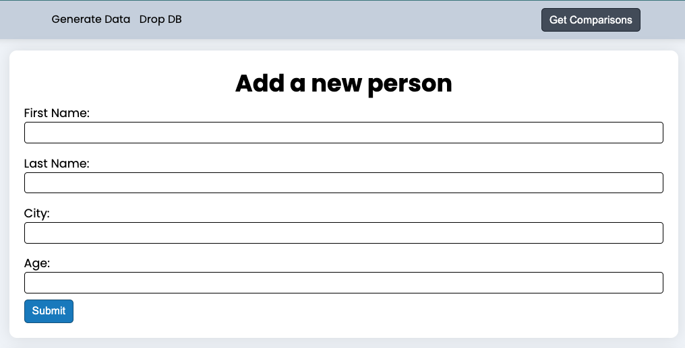
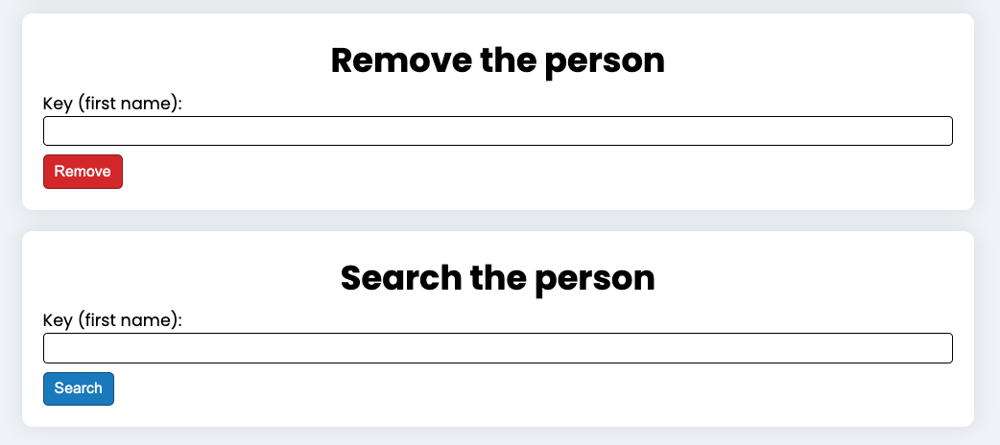
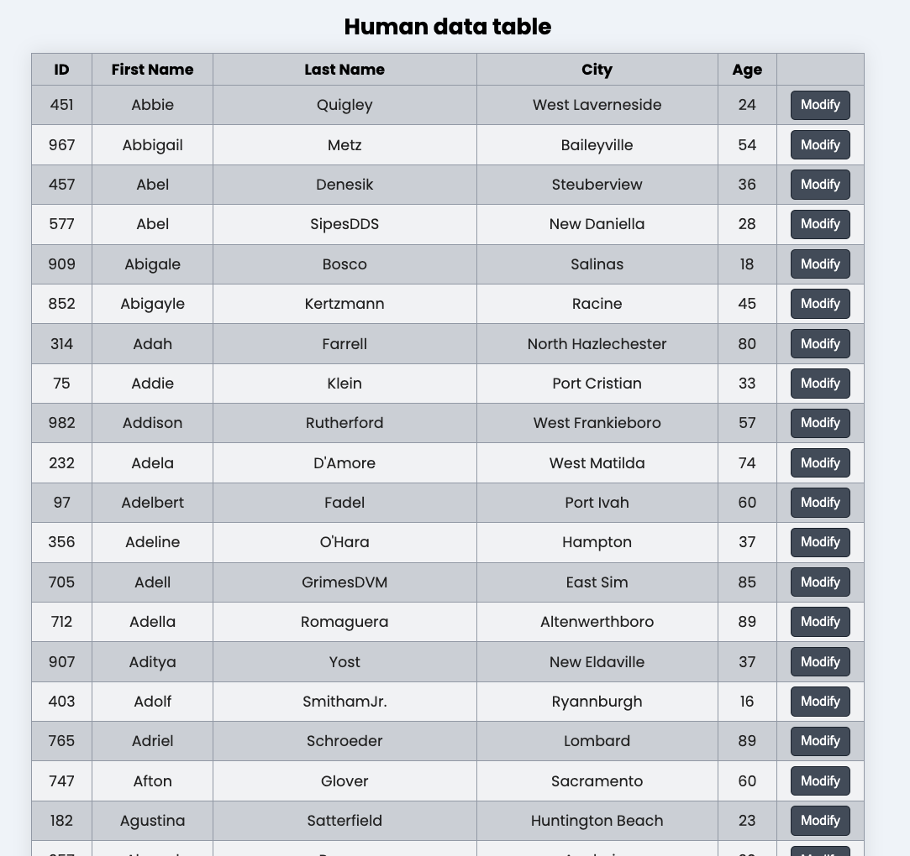

# Custom simple DBMS

That's the program that utilizes B Tree data structure to implement CRUD operations on a text-file DB

The heart of the program is written in C++ for faster I/O operations. It's done in the form of CLI. Firstly, DBMS loads current data into the RAM and then can perform various operations on data.

The main interaction is performed on the client side which is the React application that communicates with a server that runs on Node Express to handle various requests. It then runs binary file written in C++, parses response and sends data to the client, where it then is displayed.

To fill out DB there is a data generation and you can count an average number of comparisons that's needed to find a certain item in DB.

Indexing is built upon person's first name. That means that db stores and searches data by means of the key that is first name.

## Client view

- Insertion form



- Deletion and search forms



- Data Table



## Installation guide

1. Clone this repo

2. Make sure you have node installed

3. Set up client

```
cd client
npm install
npm run dev
```

4. Set up server

```
cd server
npm install
npm start
```

5. Compile c++ program

```
(install gcc compiler if you don't have one)
cd dbms
make
```

6. Create db folder for the future database

```
(it should be aside build, obj and src folders inside dbms)
cd dbms
mkdir db
```

7. Update hardcoded db paths

```
Go into the server/controllers/person.js to the line 203
and update db path to the one on your machine

Go into the dbms/src/DBMS/DBMS.hpp and update db path one line 15
```
